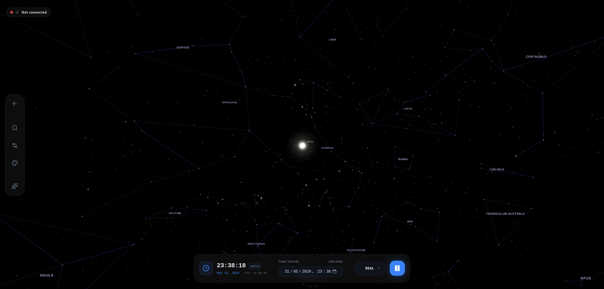

<div align="center">
    
  <h3><strong>Automated Smart Telescope Remote Assistant</strong></h3>

  <p>
    
    
    
    
    
  </p>
  
  <p><i>The unified, distributed platform for modern amateur astronomy.</i></p>
</div>


## 🌌 What is ASTRA?

**ASTRA** is an open-source **Unified Astronomy Platform** designed to bridge the gap between complex astronomical hardware and the modern web. It provides a complete ecosystem for remote observatory management, real-time celestial navigation, and automated equipment control.

Traditional astronomy setups often require a dedicated, heavy desktop computer application tethered directly to the telescope, filled with overwhelming menus and complex configurations for amateurs. 

**ASTRA breaks this barrier by decoupling the hardware from the interface.** By using a distributed architecture, it allows you to run your equipment via a lightweight edge node while you control everything from a clean, high-performance web dashboard. Whether you are a seasoned astrophotographer or an occasional observer, ASTRA ensures you spend less time fighting with settings and more time discovering the wonders of the night sky.

<div align="center">
  
</div>


## ✨ Key Features

### 📡 Distributed Edge Control (`astra_edge`)
The heart of ASTRA's hardware integration. The **Edge Node** runs directly on your observatory computer (e.g., Raspberry Pi) and communicates natively with **INDI servers**.
- **Native INDI Integration:** Full control over telescopes, mounts, cameras, focusers, and filter wheels.
- **Hardware Abstraction:** Standardized interface for diverse equipment brands.
- **Remote Tunneling:** Securely connect your local hardware to the ASTRA cloud for global access.
- **Real-time Telemetry:** Low-latency monitoring of equipment status and environment.

### 🔭 Immersive 3D Dashboard
A high-performance web interface built with **Svelte 5** and **Three.js**.
- **3D Sky Visualization:** Real-time rendering of the celestial sphere and your equipment's orientation.
- **Responsive Control:** Manage your entire session from any device (Desktop, Tablet, Mobile).
- **Observation Management:** Plan, log, and review your sessions with ease.

### 📚 Sideris Physics & Catalog Engine
A dedicated service for precision astronomical calculations.
- **Massive Catalogs:** Instant access to thousands of stars and Deep Sky Objects (Messier, NGC, IC).
- **Precision Ephemerides:** High-accuracy position calculations for Solar System objects using `Astropy` and `SkyField`.
- **Visibility Planning:** "What's in the sky" calculations tailored to your specific location and time.

### 🤖 AI-Powered Assistance
An optional, model-agnostic layer to simplify complex workflows.
- **Natural Language Control:** "Can you suggest me what DSO objects could I see tonight?" or "What is the current altitude of Mars?"
- **Context-Aware Knowledge:** Integrated with Wikipedia and celestial catalogs to provide on-the-fly info about your targets.
- **Task Automation:** Streamline repetitive setup routines through text.


## 🏗️ Architecture

ASTRA uses a containerized microservices architecture:

- **astra_ui:** Svelte 5 frontend with real-time 3D visualizations.
- **astra_api:** Central coordinator, session manager, and AI router.
- **astra_auth:** Secure JWT-based authentication and access control.
- **astra_edge:** Hardware abstraction layer (INDI).
- **sideris:** Specialized service for catalog lookups and ephemerides.
- **Kong Gateway:** Unified entry point and secure routing.

## 🚀 Getting Started

For detailed deployment instructions and technical overview, please refer to the documentation:

- [🏗️ Architecture Overview](docs/ARCHITECTURE.md)
- [🚀 Detailed Deployment Guide](docs/DEPLOY_GUIDE.md)
- [🛰️ Edge Node (Hardware) Guide](docs/EDGE_GUIDE.md)
- [📖 User Guide](docs/user_guide/USER_GUIDE.md)

### Prerequisites
- Docker and Docker Compose.
- (Optional) An INDI-compatible telescope or simulator.

### Quick Start
1. **Clone the repository:**
   ```bash
   git clone https://github.com/jesusbasalloteinfo/Astra.git
   cd Astra
   ```

2. **Setup environment:**
   ```bash
   cp example.env .env
   # Edit .env and add your AI_API_KEY for the assistant
   ```

3. **Launch the platform:**
   ```bash
   docker compose up -d
   ```

4. **Access the UI:**
   Open your browser and navigate to `http://localhost:8000`.


## 🛠️ Tech Stack

- **Frontend:** Svelte 5, TailwindCSS 4, Three.js, Lucide Icons, Paraglide-js (i18n).
- **Backend:** FastAPI, Python 3.11+, MongoDB (Core), PostgreSQL (LLM State).
- **Protocols:** INDI (Hardware), WebSockets (Real-time), REST (API).
- **DevOps:** Docker, Docker Compose, Kong Gateway.

## 📁 Project Structure

```text
├── astra_api/      # Core Coordination API
├── astra_auth/     # Authentication & User Service
├── astra_edge/     # INDI Hardware Node
├── astra_ui/       # Svelte 5 Frontend
├── sideris/        # Physics & Catalog Engine
└── gateway/        # Kong API Gateway
```

## 🌱 Project Status

ASTRA is currently in active development! I am focusing on core features and stability. While I am not accepting major pull requests just yet, your feedback is highly valuable. Please feel free to open an **Issue** to report bugs or suggest enhancements.

## 🤝 Credits

ASTRA is made possible by the following open-source projects:

* [indipyclient](https://github.com/bernie-skipole/indipyclient/)
* [FastAPI](https://fastapi.tiangolo.com/)
* [Svelte](https://svelte.dev/)
* [Three.js](https://threejs.org/)
* [LiteLLM](https://github.com/BerriAI/litellm)

## 📜 License

Distributed under the **AGPL v3 License**. See [LICENSE](LICENSE) for more information.

---

<div align="center">
  <p><strong>Clear skies and happy observing! 🔭</strong></p>
</div>
