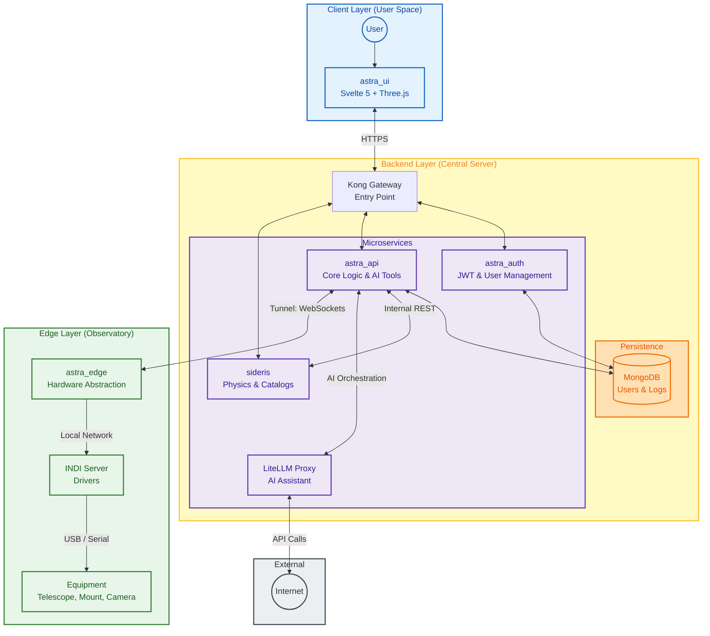

# ASTRA Architecture

ASTRA follows a modern, containerized microservices architecture to ensure scalability, flexibility, and robust performance. The system is split between a **Central Server** (which hosts the UI, AI, and APIs) and an **Edge Node** (which handles direct hardware control).

## 📊 System Overview

The application is composed of several specialized services communicating through a Kong API Gateway.

### Core Services

1. **astra_ui (Frontend)**
   - **Tech Stack:** Svelte 5, TailwindCSS 4, Three.js, Paraglide-js.
   - **Role:** The user-facing interface providing 3D visualizations, dashboard controls, and chat interface with the AI assistant.

2. **astra_api (Core Backend)**
   - **Tech Stack:** Python 3.11+, FastAPI, MongoDB, Pydantic.
   - **Role:** Central orchestrator. Manages user sessions, device pairing, observations, and tool routing for the AI assistant.

3. **sideris (Physics & Catalog Engine)**
   - **Tech Stack:** Python, FastAPI.
   - **Role:** A dedicated physics service that handles celestial calculations, planetary ephemerides, and sidereal catalog lookups.

4. **astra_edge (Hardware Abstraction Layer)**
   - **Tech Stack:** Python, aiohttp, INDI.
   - **Role:** Runs on edge devices (like a Raspberry Pi) and communicates natively with INDI servers. It maintains a persistent tunnel with the Central Server.

5. **astra_auth (Authentication Service)**
   - **Tech Stack:** Python, FastAPI.
   - **Role:** Dedicated service for secure user management and JWT generation using RSA key pairs.

## 🛠️ Data & Control Flow

Understanding how ASTRA handles a hardware command (e.g., "Slew to M42"):

1. **Request:** The user triggers a command in `astra_ui`.
2. **Gateway:** The request hits **Kong Gateway**, which routes it to `astra_api`.
3. **Logic:** `astra_api` validates the user's JWT and identifies the active `astra_edge` node for that user.
4. **Tunnel:** The command is encapsulated and sent through a persistent **WebSocket tunnel** to the remote `astra_edge` instance.
5. **Execution:** `astra_edge` receives the command, translates it to the **INDI protocol**, and communicates with the local INDI server.
6. **Feedback:** Telemetry and status updates flow back through the same tunnel in real-time to update the UI.

## 🔒 Security Model

- **JWT Authentication:** All sensitive requests are protected by JSON Web Tokens.
- **RSA Signing:** `astra_auth` signs tokens using a private RSA key. Other services verify these tokens using a public key fetched from the auth service.
- **Service Isolation:** Microservices are isolated in internal Docker networks. Only the Kong Gateway and the UI are exposed to the outside world.
- **Edge Security:** Devices are paired using unique hardware fingerprints and temporary pairing codes, ensuring only authorized users can control specific equipment.

## 🧠 Design Philosophy

- **Decoupling:** Hardware control (`astra_edge`) is strictly decoupled from the interface to allow low-latency execution and high availability even with intermittent internet connections.
- **AI Agnosticism:** By utilizing LiteLLM, ASTRA provides flexibility in model selection (GPT, Claude, Gemini) without changing the core codebase.
- **Distributed Computing:** Heavy calculations (Sideris) and AI processing are handled by the server, keeping the edge node lightweight and efficient.
