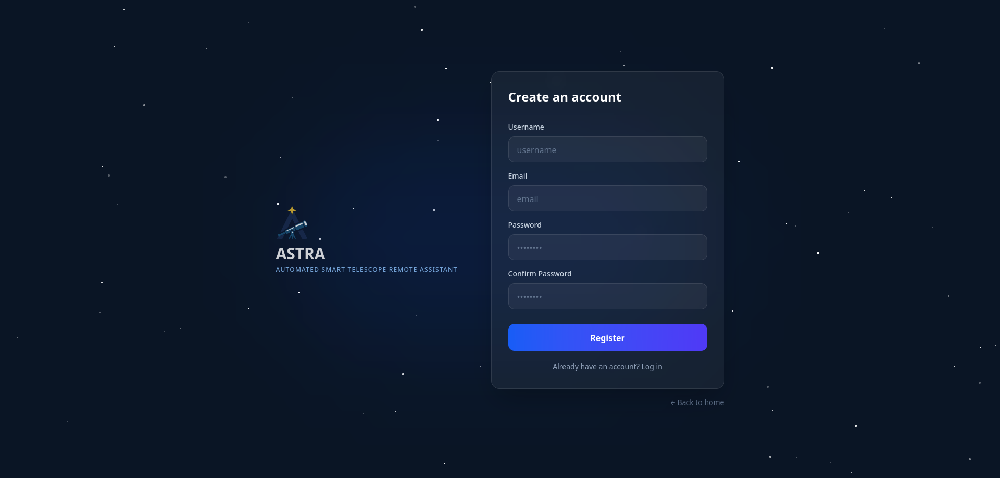
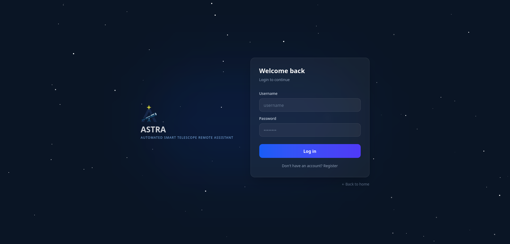

# Chapter 1: Welcome to Astra

Astra is not just a control tool; it's your gateway to exploring the universe. In this first chapter, we'll see how to navigate the application's presentation and how to create your account.

## 1.1 The Welcome Page (Landing Page)
When you access Astra, you'll find a presentation page designed to show you the system's potential.

### Main Sections:
*   **Hero Section:** The main message "Explore the Universe with Astra" and the "Start Exploring" button that will take you directly to registration.
*   **Advanced Features:** A visual summary highlighting intelligent control, the 3D map, and AI assistance.
*   **Technology:** Information on how Astra uses the INDI protocol to be compatible with thousands of telescopes and mounts worldwide.
*   **Statistics:** A quick look at the system's capabilities regarding supported objects and tracking precision.

## 1.2 The Registration Process

To be able to save your observations and hardware configurations, it is essential to have a personal account.

### How to create your account step by step:
1.  Click the **"Sign Up"** button on the login screen.
2.  **Username:** Choose a name that identifies you. This name will be what Astra AI uses to greet you!
3.  **Email:** Use a valid address. It is fundamental for managing your account.
4.  **Password:** For your security, the password must have **at least 8 characters**.
5.  **Confirmation:** You must type the same password a second time to avoid typing errors. The application will warn you if they don't match before letting you continue.

Once the fields are filled, press the **"Create an account"** button. If everything is correct, you'll receive a confirmation message and can log in immediately.

## 1.3 Login

If you are already a registered user:
1.  Enter your **Username** (or email).
2.  Type your **Password**.
3.  Press **"Log In"**.

### Error Management
Astra is designed to help you. If you make a mistake with your credentials, you'll see a clear notice at the bottom of the form indicating if the user doesn't exist or if the password is incorrect, allowing you to rectify without having to reload the page.

---
