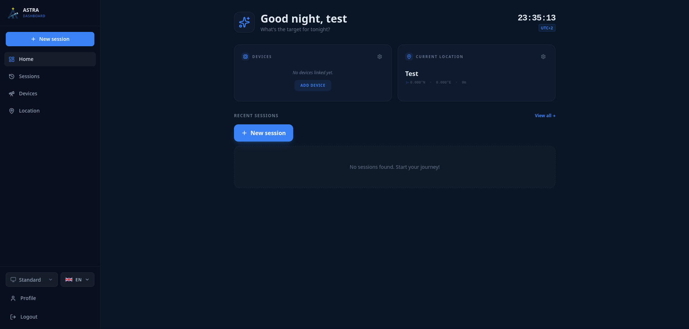
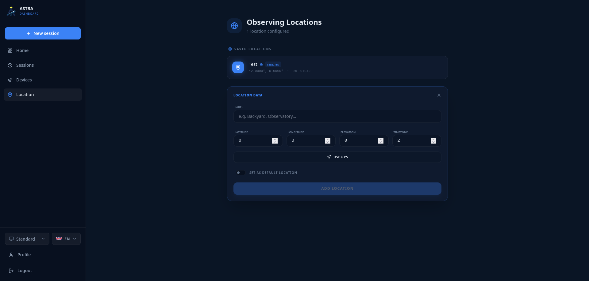

# Chapter 2: The Heart of Astra (Dashboard and Geolocation)

Once you have logged in, you will arrive at the **Control Panel (Dashboard)**. This space is the brain of the application, from where you can monitor the status of your equipment and manage your position on Earth, a critical factor for precision astronomy.

## 2.1 Anatomy of the Dashboard

The interface is designed to be clean and informative. These are its main parts:

### Dynamic Greeting
At the top, Astra will welcome you with a message that changes according to the time (Morning, Afternoon, Evening, or Night).

### Device Widget
On the left side, you'll see a summary of your hardware.
*   **Connection status:** Indicates if you are connected to an INDI server.
*   **Active devices:** Shows quick icons for the telescope if detected.
*   **Quick access:** You can click to go directly to advanced device configuration.

### Location Widget
On the right side, you'll find information about your current position.
*   **Coordinates:** Shows active Latitude and Longitude.
*   **Location name:** The custom name you've chosen (e.g., "Montseny Observatory").
*   **Configuration status:** If you don't have any location configured, Astra will show a **"Zero Configuration"** warning.

## 2.2 Customization and Profile
Astra allows you to adapt the work environment to your preferences from the sidebar or the navigation menu.

### Visual Themes
You can change the general appearance of the application to adapt it to your observation environment:
*   **Theme Selector:** Located at the bottom of the sidebar, it allows you to choose between different color combinations. Remember that during real observation (SkyMap 3D), you can activate the **Astronomical Mode (Red)** to protect your night vision.

### User Profile Configuration
By clicking on your name or user icon at the end of the sidebar, you can access the **Profile Configuration**:
*   **Profile Picture:** You can upload a custom image to identify your account.
*   **Personal Data:** You can update your full name and biography.
*   **Language:** Astra is multi-language. You can change the interface language from the selector located next to the theme selector.

## 2.3 Location Configuration (Geolocation)

Astronomy is, in essence, geometry from your position. For the 3D map and the telescope to work well, Astra must know where you are.

### How to add a new location:
1.  Go to the **Location** section from the side menu or press "Configure" in the Dashboard widget.
2.  Press the **"+ New Location"** button.
3.  **GPS Detection:** Press the compass/navigation icon to use your device's GPS. Astra will automatically fill in the latitude, longitude, and time zone.
4.  **Manual Configuration:**
    *   **Label:** Give it a name (e.g., "Home").
    *   **Latitude/Longitude:** Coordinates in decimal format.
    *   **Elevation:** Height above sea level in meters (helps with atmospheric refraction precision).
    *   **Time Zone:** The offset from UTC (e.g., +1 for Barcelona in winter).
5.  **Set as default:** If you check this option, Astra will always load this location when logging in.

### Managing Multiple Places
You can have as many locations as you want (e.g., "Home", "Airfield", "Observatory"). You can switch between them by clicking the "mark" icon on the desired location card. Astra will instantly update all celestial calculations for the new place.

## 2.4 Why is Location so Important?
Astra's astronomical engine uses your coordinates to:
1.  **Calculate Altitude and Azimuth:** To know if an object has risen or is below the horizon.
2.  **Simulate the Atmosphere:** Atmospheric color simulation based on the Sun's position.
3.  **Synchronize the Telescope:** Mounts need to know the exact latitude for sidereal tracking.

Without a precise location, the telescope wouldn't be able to point towards celestial objects, nor show the position simulation.

---
