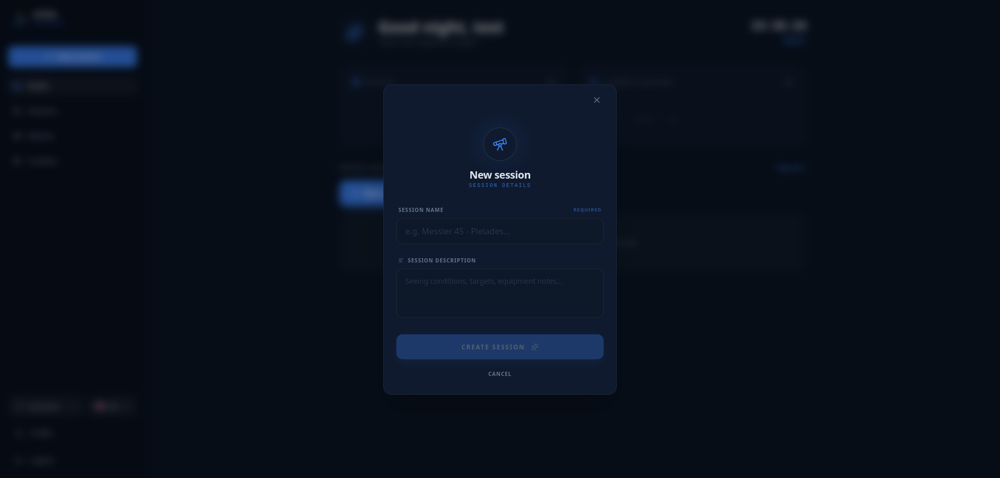

# Chapter 4: Astronomer's Diary (Session Management and History)

In Astra, work is organized through **Observation Sessions**. A session is not just opening a map; it's a container where all your actions, notes, and the state of the sky for a specific night are saved. In this chapter, you'll learn to manage your astronomical history.

## 4.1 What is a Session?
Imagine a session like a page in a logbook. Every time you go out to observe, you create a new session. This allows you to:
*   Keep an organized record of your observations.
*   Separate different types of observation (e.g., "Planetary Session" vs. "Deep Sky Session").

## 4.2 Creating a New Session
To start observing, you must create a session:
1.  From the **Dashboard** or from the **Sessions** section, press the **"+ New Session"** button.
2.  **Session Name:** Give it a clear title (e.g., "Jupiter and its Moons"). This field is mandatory.
3.  **Description (Optional):** You can add details about what you want to do, the weather status, or the equipment you'll use.
4.  **Confirm:** Press "Create session". Astra will automatically take you to the 3D map interface to start the exploration.

## 4.3 History Management (Session List)

In the **Sessions** section, you'll see a chronological list of all your activity.

### Session Card Information:
*   **Title and Description:** The data you entered when creating it.
*   **Creation Date:** When the observation was performed.

### Quick Actions:
If you hover the mouse over (or long press on mobile), two icons will appear on the right side:
*   **Pencil Icon (Edit):** Allows you to modify the name or description of an already created session.
*   **Trash Can Icon (Delete):** Permanently deletes the session. Astra will ask for confirmation before proceeding.

## 4.4 Resuming a Session
Simply by clicking on any card in the list, you will re-enter the observation interface.

---
