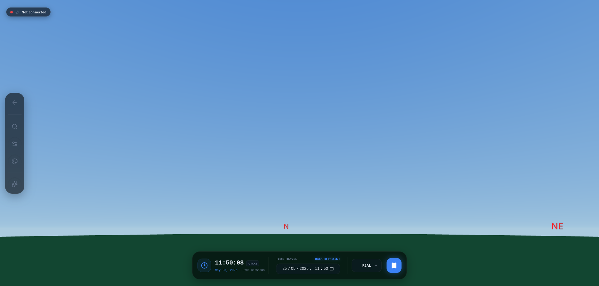

# Chapter 5: Exploring the Cosmos in 3D (SkyMap 3D)

Upon entering a session, Astra activates its three-dimensional simulation engine. In this chapter, you will learn to navigate the sky, customize your view, and control the flow of time.

## 5.1 Navigation and Interaction

Astra's interface is highly interactive and allows for smooth exploration:
*   **Rotation:** Click and drag (or swipe with your finger on touchscreens) to look in any direction.
*   **Zoom:** Use the mouse wheel or pinch the screen to zoom in on distant objects.
*   **Object Selection:** Click on any star, planet, or nebula. Doing so will mark the object with a circle and open the details panel (which we will see in Chapter 6).

## 5.2 Object Search (SkyFinder)
If you are looking for a specific object by its name or catalog code:
1.  Press the **Magnifying Glass** icon on the side panel or use the keyboard shortcut `Ctrl+F` (or `Cmd+F`).
2.  Type the name (e.g., "Mars", "Andromeda", "M42", "Sirius").
3.  Astra will show results as you type. Click on the result to automatically center the view on the object.

## 5.3 View Customization (Side Dock)
On the left side of the screen, you'll find the **Side Dock**, from where you can adjust how the sky looks:

### Sky Configuration:
*   **Constellations:** Activate lines, names, or Latin names of celestial figures.
*   **Atmosphere:** Simulates the effect of sunlight in the air. You can turn it off to see the stars during the day.
*   **Ground:** You can hide the ground to see what's below the horizon or make it "transparent" to have a real reference of what you can actually see from your observation site.

### Visual Themes:
*   **Night Mode (Astronomical):** Vital for field observations. The entire interface turns dark red to protect your dark adaptation and avoid glare.

## 5.4 The Time Controller
At the bottom, you'll find the time panel. Astra allows you to travel through time to plan observations:
*   **Real Time:** Shows local time and UTC time.
*   **Pause and Play:** You can stop the Earth's movement to study an area.
*   **Playback Speed:** You can speed up time (up to 1 hour per second) to see how planets move or how constellations rise.
*   **Time Jump:** Click on the date or time to select a specific moment in the past or future.

---
