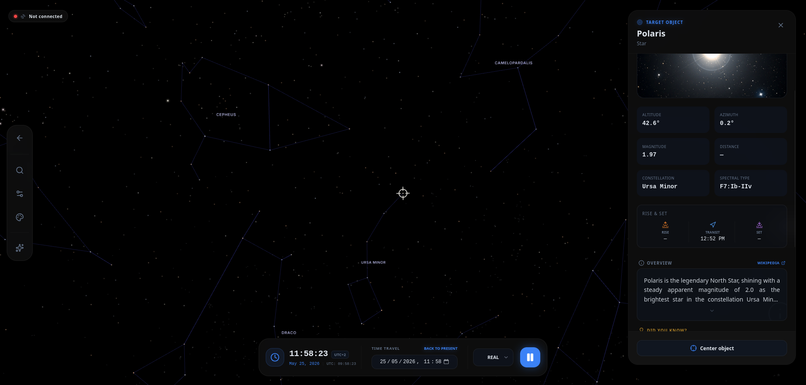

# Chapter 6: Telescope Command and Live Data

Astra especially shines when it becomes the control center for your hardware. In this chapter, you will learn to move your telescope towards targets and interpret all the information Astra offers about each selected object.

## 6.1 The Details Panel: The target's control center

When you select an object (star, planet, or nebula) on the 3D map, a panel opens on the right side (or bottom on mobiles) with all the information and action controls.

### Movement Operations
At the bottom of this panel, you'll find the main action buttons:
*   **Center on Map:** This option adjusts the 3D simulation camera to put the object at the center of your screen. It does not move the physical telescope.
*   **Slew + Track:** This is the key button. If you have a telescope connected and configured, pressing this button will physically move the mount towards the object. Once it arrives, the telescope will maintain automatic tracking to compensate for the Earth's rotation.
    *   *Note:* This button will only appear if your device is **Online** and you have selected a telescope component (see Chapter 3).

## 6.2 Detailed Target Information
While observing, the panel offers comprehensive data for your session:

### Real-Time Astronomical Data
*   **Altitude and Azimuth:** Local coordinates that indicate exactly where the object is relative to your horizon.
*   **Magnitude:** The brightness of the object.
*   **Specific Data:** Depending on the object, you may see other data such as distance to Earth or lighting percentage (in the case of the Moon or Venus).

### Visibility Information
*   **Rise, Transit, and Set:** Indicates what time the object appears, when it is at the highest point in the sky (optimal observation time), and when it disappears.

### Educational Content:
*   **Images:** A real preview of the object.
*   **Description:** Detailed information about the nature of the object.
*   **Fun Facts:** Small bits of interesting information to share during an observation.
*   **Visual Tips:** Gives you tips for better observing the object.

## 6.3 The Status Indicator (Telescope Controller)
At the top of the screen, you'll see an informative "pill" indicating the overall state of the equipment:
*   **Green/Red light:** Indicates if the device is connected.
*   **Device Name:** Reminds you which equipment you are managing.

By clicking on the indicator, a menu will open with the following operations:
*   **Center on Map:** If you want the 3D map camera to fly to where the telescope is in the simulation.
*   **Stop Movement (Abort):** In case of emergency (for example, if a cable gets tangled), press this red button to instantly stop any motor movement.

---
