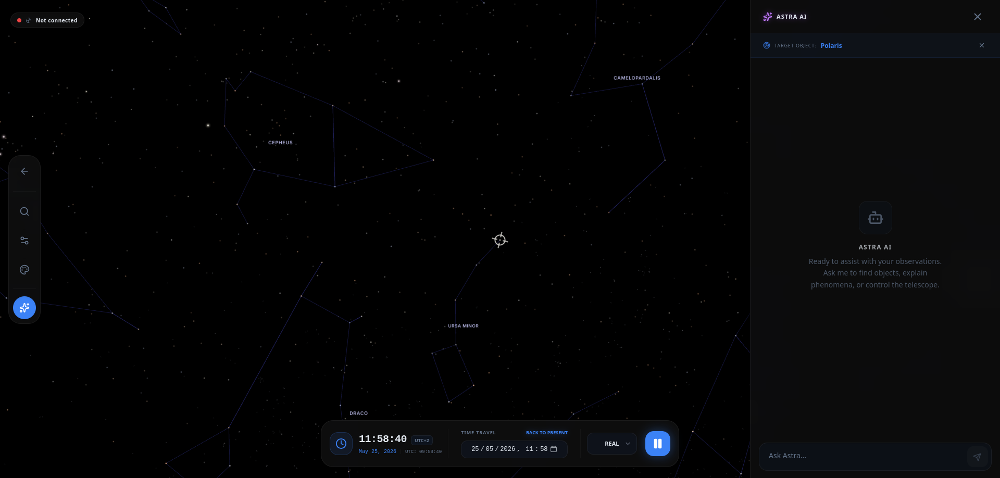

# Chapter 7: Astra AI (The Intelligent Assistant)

Astra is not just a celestial map; it includes an advanced assistant based on Artificial Intelligence that acts as your astronomical helper. In this chapter, you will learn to get the most out of Astra AI to make your observation easier and more educational, based on its real control and inquiry capabilities.

## 7.1 What is Astra AI?
The assistant is a language model specialized in astronomy that has real-time access to the context of your observation session. Unlike a generic chat, Astra AI knows:
*   **Your exact location:** It knows which objects are above the horizon for you.
*   **The selected object:** If you click on a star or nebula on the 3D map, the AI knows exactly what you are looking at.
*   **The status of your telescope:** It detects if you have equipment connected and can send direct commands to it.

## 7.2 How to Interact with the Assistant

You can open the chat by pressing the **Sparks** icon on the side panel of any observation session.

### Target Context
If you have an object selected on the map, you will see that the chat shows a label at the top with the object's name (e.g., "Target: M31"). This allows you to ask questions such as:
*   "How far away is this object?"
*   "Tell me some fun facts about it."
*   "Is it visible to the naked eye?"

## 7.3 Real AI Capabilities (Tools)
Astra AI doesn't just talk; it can execute actions through integrated tools:

### A. Precision Astronomical Inquiries
The AI uses the **Sideris** database to obtain exact scientific data (magnitude, coordinates, rise and set times) and **Wikipedia** for historical, mythological information or deep scientific explanations.

### B. Interface Control (UI)
You can ask the AI to show you objects on the 3D map for you:
*   **Center objects:** "Find the Andromeda Galaxy" or "I want to see Jupiter." The AI will center the object on your screen.
*   **Fly to constellations:** "Take me to the constellation of Orion." The camera will fly until it shows you the full constellation.

### C. Telescope Command (Slew)
If you have a paired and online telescope (see Chapter 3), the AI can physically move it:
*   **Movement command:** "Point the telescope towards the Orion Nebula."
*   **Safety protocol:** The AI will always inform you of its intention before moving the motor. If you ask to observe the Sun, the AI **will refuse to move the telescope** unless you explicitly confirm that you have a professional solar filter installed, to protect your equipment and your eyesight.
*   **Objects below the horizon:** If you ask to point to an object that hasn't risen, the AI will warn you that it is below the horizon and suggest an alternative target.

---
